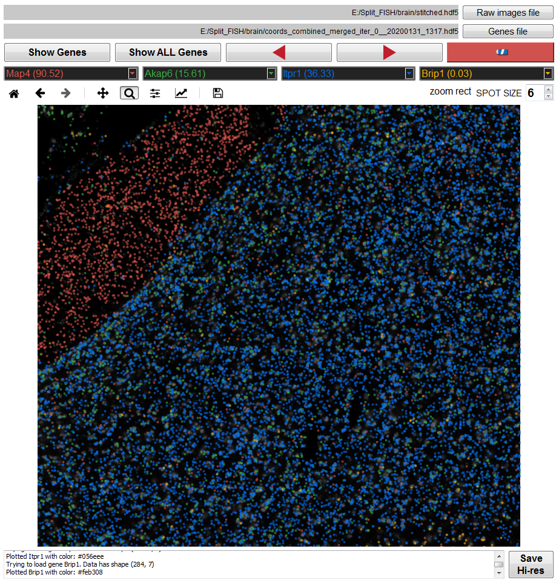
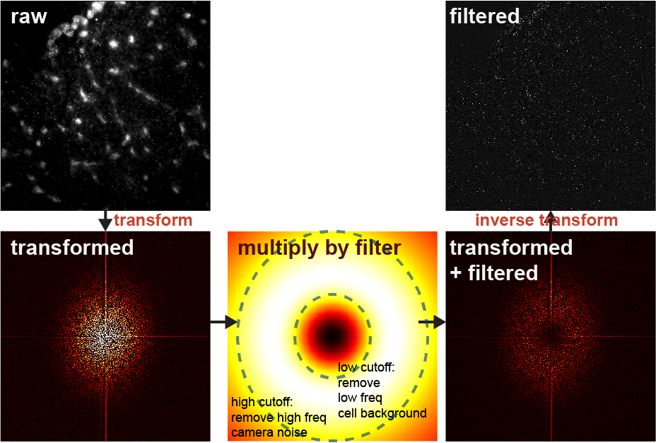
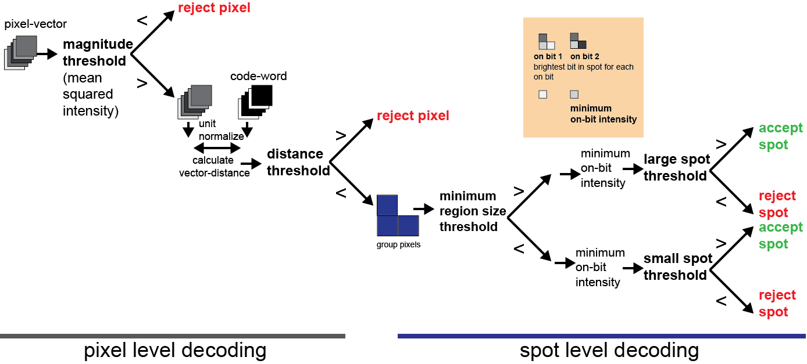

# Multiplexed FISH Image Analysis
A multiplexed FISH image analysis pipeline for multi-FOV datasets using a pixel-vector decoding approach. Will work for any coding scheme. Allows for visualization of correlation to bulk FPKM counts, and stitches images and spots. 

## Contents

- [Prerequisites](#prereqs)
   - [system requirements](#sysreqs)
   - [software requirements](#softreqs)
   - [tested dependencies](#depreqs)
- [Getting started](#getstart)
   - [Installation](#install)
   - [Demonstration of code](#demo)
   - [Time taken to run](#runtime)
   - [Split-FISH paper figure generation](#figs)
   - [Step-by-step guide](#sbs)
- [Parameter settings explained](#settings)
- [Citations and code dependencies](#cite)
- [Authors](#authors)
- [License](#lic)
- [Acknowledgements](#ack)

## Prerequisites <a name="prereqs"></a>

### System requirements: <a name="sysreqs"></a>

A computer that can run Python, with at least 16 GB of RAM. No non-standard hardware is required.

### Software requirements: <a name="softreqs"></a>

1.	Split-FISH analysis package
2.	Python 3.7.3
3.	numpy: 1.18.1
4.	pandas: 1.0.3
5.	h5py: 2.9.0
6.	matplotlib: 3.1.0
7.	seaborn: 0.10.0
8.	scikit-image: 0.16.2
9.	scikit-learn: 0.22.1
10. scipy: 1.4.1

### Specific Software Dependencies: <a name="depreqs"></a>

This software has been tested on the following versions of software packages:
1.	Python: 3.7.0, 3.7.3, 3.7.4
2.	Spyder: 3.3.6, 4.1.1
3.	numpy: 1.15.1, 1.16.4, 1.16.5, 1.18.1
4.	pandas: 0.23.4, 0.24.2, 0.25.1, 1.0.3
5.	h5py: 2.8.0, 2.9.0
6.	matplotlib: 2.2.3, 3.1.0, 3.1.1
7.	seaborn: 0.9.0, 0.10.0
8.	scikit-image: 0.14.0, 0.15.0, 0.16.2
9.	scikit-learn: 0.19.2, 0.21.2. 0.21.3, 0.22.1
10. scipy: 1.1.0, 1.4.1

## Getting Started <a name="getstart"></a>

   
### Installation <a name="install"></a>
1.	Download and install [Anaconda](https://www.anaconda.com/distribution/#download-section).
2.	**Spyder** and the required packages will be installed with **Anaconda**. No further library installation is required.
3.	Installation of **Anaconda** typically takes less than 30 minutes. 
4.  Code has been tested to run on **Spyder** and **PyCharm** but also can also be run from command line (run `MainScript.py`) or any other Python 3 compatible IDE.


### Demo <a name="demo"></a>

  
1.	**`MainScript.py`**   
This script analyzes multiplexed-FISH data. Requires example datasets <brain>.   **_Output:_**  The analysis script generates an output folder with the gene coordinates (`.hdf5` files), gene counts, and imagedata `.hdf5` files containing metadata and intermediate processing stage outputs. Plots comparing total counts to bulk FPKM values, visualizations of per-FOV FPKM correlation and counts on a grid, and tables of gene counts are saved in the `qc` folder within the `output` folder. A summary file is also generated.

2.	**`stitchMstClasses.py`**   
This script stitches together images and spot coordinate positions after analysis. Output from the main script is required. When run, this script will allow selection of the main data directory as well as the directory where the output of the main script is stored. The bit used for stitching should match the reference bit used for registration in the main script. **_Output:_**    A combined coordinates file of the gene spot coordinates (`coords_..._<date>.hdf5`) as well as a stitched image (`stitched.hdf5`) file. 

3.	**`spotViewer.py`** – This simple GUI allows visualization of gene spot locations `coords_..._<date>.hdf5` overlaid on the stitched image `stitched.hdf5`, either for 4 genes at a time or for all genes. A stitched image file is required to view the spots.
    
 <details><summary>click to view screenshot of SpotViewer</summary>
   
 
 </details>


### Expected runtime <a name="runtime"></a>
`MainScript.py` took 7-8 minutes to run on the example dataset, while `stitchMstClasses.py` took less than 1 minute to run. Both analysis steps were done on a computer with Intel Core i7-6700 CPU @ 3.40GHz, 8 cores and 32GB RAM.


### Split-FISH manuscript figures <a name="figs"></a>
Scripts and data used for the manuscript figures can be found in the [splitFISH_manuscript_figures folder](splitFISH_manuscript_figures). When running the code, a dialog window will open up asking for the directory containing data. Select the main folder for each figure, e.g for Figure 1, navigate to [this folder](splitFISH_manuscript_figures/Figures/Figure1/).

When using **Spyder** to run split-FISH_manuscript_figures:
1. Go to tools > Preferences > Current working directory.
2. Set the current working directory to the home folder of the split-FISH library.

### Step-by-Step Guide <a name="sbs"></a>

<details><summary>follow these steps:</summary>

1. Open the `MainScript.py` file in Spyder. 
 
2. Look for the `Define user’s base parameters` line: fields below that need changing. Refer to parameter descriptions for more information. For the purpose of this guide we will only be exploring some basic parameters. 
 
3. `file_params[“fpkm_filepath”]` specifies Location of the FPKM file for the dataset. Change the file name / location accordingly. In this example, we will run the [brain dataset](ExampleDatasetBrain). 
 
4. `“fovs_to_process”`: Provide a list of FOVs for analysis. Four FOVs are provided in the brain dataset, from 0 to 4. You can either type in the list manually, or by using Python's `list(range())` function. 
 
5. `“hyb_list”` and `“type_list”` are important parameters that tell the script which images correspond to which bit of the codebook. The correct `“hyb_list”` and `“type_list”` for the example dataset has been provided in the `MainScript.py`, but as an example, for a dataset with **6 bits** run in **3 hybridization rounds** using only the **Cy5** and **Cy7** channel:
```Python
split_fish_params["hyb_list"] = [0, 1, 2, 0, 1, 2]
split_fish_params["type_list"] = ["Cy5", "Cy5", "Cy5", "Cy7", "Cy7", "Cy7"]
```
Here, Bit 1, 2, and 3 are ran in **hybridzation rounds** 0, 1, and 2 respectively, and imaged in the **Cy5** channel. 

6. Run the script. A pop up window will appear behind the Spyder window asking you to select the data directory. Navigate to the location of the demo dataset and hit *select folder*.

7. The code will start running the analysis. The analysis is complete when the console reports the time taken to run the whole script.

8. The code will create three folders in the data directory – *output*, *data_tables*, and *filters*. The *output* folder is where you will find results – FPKM plots, gene coordinates, gene counts, and more. A `.tsv` file summary will also be generated. Example:

| | **correlation** | **p_value** | **total_count** | **percent_above_blank** | **gene_blank_ratio** |
| --- | --- | --- | --- | --- | --- |
| split_fish_4fovs_test | 0.74 | 1.94E-3 | 14498 | 76 | 20 |

#### Stitching

9. Stitching can only be done after the main analysis has been completed. The script will look for the image from bit `basebit`, but the approprate bit to use can also be specified by a combination of `basetype` (referring to colour channel) and `basehyb` (referring to hybridization round) if you set `basebit = None`. For this example we use bit 14 as our `basebit`. **Important: The `basebit` must be the same as the `reference_bit` set in the main script, otherwise the spots will be offset from the image.** 

```Python

# Define parameters
# -----------------

microscope_type = "Dory"
basebit = 14
basetype = "Cy5"
basehyb = 0
```

10. Run the code. A popup window will appear behind the Spyder window, asking you to choose the main data directory. Navigate to the folder where the images are and *select folder*. Next, a window will appear asking to choose the directory with the processed images and spots data. Navigate to the specific output folder where the hdf5 coordinates files are located. In this guide, with the provided example output, this would be the “`split_fish_4FOVs_mag0_40_ssth0_80_<date>`” folder. Select the folder and let the stitching program run. _**Note** For example dataset, field correction masks (estimated from all 49 FOVs) are not provided and may result in suboptimal stitcing output._

#### SpotViewer

11. **SpotViewer** can be used to open `.dax` and `.hdf5` image files, as well as `.hdf5` spot coordinate files for gene location visualization. Open the `spotViewer.py` script with Spyder and run the script. Click the **‘Raw images file’** button, and select the `stitched.hdf5` file generated from the stitching code. Wait a moment for the stitched image to appear. You can then adjust the contrast of the image using the figure button. Click the **‘Genes file’** button, and select the `coords_combined_merged_<date>.hdf5` file generated from the stitching code.

12. Clicking on the **'View ALL Genes'** button will show all the genes in the `.hdf5` spot coordinate files; clicking on **'Show Genes'** will display the genes selected in the drop down menus.  Clicking on the **'Eraser'** button will remove all gene spots. Gene spot size can be adjusted in the **'SPOT SIZE'** field.

13. The displayed image can be saved using the save button; hi-res images can be saved by using the **'Save Hi-res'** button. 

</details>


## Parameter Settings <a name="settings"></a>

An explanation of each of the parameters used for decoding in `MainScript.py`.

### Main parameters
<details>

  <summary>Detailed explanations:</summary>


* **hyb_list, colour_list, num_bits**   
   2 sets of lists of the same length that specify the hybridization round number (type ```int```) and colour channel (type ```str```) for each bit of the coding scheme. ```num_bits``` is the total number of bits and must match the lengths of ```hyb_list``` and ```colour_list```.

* **fovs_to_process**   
   Subset of FOVs to process. Can be specified as a list of ```int```s or ```str```s. If using ```str``` to represent, you must match the filename FOV exactly. e.g. if filename is ```<colour>_<hyb>_01```, FOV must be specified as ```01```.

* **fovstr_length**   
Length of the FOV string representation e.g. ```01``` has length of 2, ```001``` has length of 3. Typically dependent on number of FOVs taken e.g. 10-99 will have string length of 2, more than 100 would have string length of 3.

* **reference_bit**   
The bit to use as a reference for registration. Make sure to use the same bit when stitching, otherwise spots will be offset from the image.

* **stage_pixel_matrix**   
Conversion matrix from stage coordinates (in um) to image coordinates (pixels). The configuration of the matrix accounts for any kind of rotation or flipping relative to physical stage coordinates. This is used to generate a grid of FOVs as well as set up starting estimates for stitching FOVs. Hence needs to be reasonably accurate but no need to be exact. e.g. Microscope used in split-probe paper has approximately 8 pixels per micron, and is flipped and has y and x axes swapped: ```8 * np.array([[0, -1], [-1, 0]])```

* **num_iterations**   
Not implemented yet in this version. Set to ```1```.

* **drop_genes**   
Not implemented. Do not use.

* **roi**   
Ignore. Not applicable to microscope used in split-probe paper. Set to ```None```.

* **fpkm_structname**   
Ignore. Legacy parameter for when we were reading matlab .mat files that contained FPKM values.


---
The following paramters toggle whether various corrections (background subtraction, field and chromatic distortion correction) are applied to images

* **correct_field**   
Whether to perform field correction. If set to ```True```, make sure to have an appropriate field correction .hdf5 file in the calibration folder. This file should contain field maps for all colours used in your imaging run.

* **imgcolour_to_maskcolour**   
A dictionary that matches the corresponding colours in the image filenames to those in the correction .hdf5 file. e.g. if you choose to use washed / bleached images for correction:

```Python
params["imgcolour_to_maskcolour"] = {
    "Cy5": "Cy5_Bleach",
    "Cy7": "Cy7_Bleach",
}
```

* **correct_distortion**  
Whether to perform chromatic distortion correction. If set to ```True```, make sure to have the appropriate colour-to-colour .tsv files.

* **type_to_colour**  
A dictionary that matches the corresponding references in the image filenames to the colour channel specifications in the distortion correction .tsv files. e.g.

```Python
params["type_to_colour"] = {
    'Cy3': '558',
    'Alexa594': '620',
    'Cy5': '684',
    'Cy7': '776',
}
```

* **reference_colour**  
The reference colour to use for correcting distortion. All other colour channels will be distorted to match this channel.

* **subtract_background**  
Whether to subtract background.  Not used in split-probe paper.


---
The following parameters change the properties of the **filter** used to preprocess the image

* **filter_order**  
The order of the 2D frequency domain filter. 2 seems to work best.

* **low_cut**  
The low frequency cutoff for the 2D frequency domain filter. Specified in **pixels**. 

* **high_cut**  
The high frequency cutoff for the 2D frequency domain filter. Specified in **pixels**. 



---
The following parameters affect the normalization of images across each bit.

* **percentile_norm_high**  
The percentile of image intensities in a single image to use for normalization, if global normalization is **not** used.

* **global_perfov_percentile, global_pooled_percentile, globalnorm_fovsubset**  
Parameters for global normalization. For each bit, all pixel intensities in each FOV above ```global_perfov_percentile``` are pooled. Then, the ```global_pooled_percentile``` intensity value of the pooled pixel intensities is used for normalization.  ```globalnorm_fovsubset``` is optional and allows use of a subset of the FOVs for global normalization.

* **clip_normalized**
Whether to clip values above the normalization value. e.g. if normalization value for filtered image is 2000, a pixel intensity value of 2200 will have a normalized value of 1.1 if this is set to ```False``` and will be clipped to 1 if this is set to ```True```.


---
The following thresholds are applied on Corrected, Registered, Filtered, Normalized and (optional) Clipped images.

* **magnitude_threshold**  
This is the root mean square of intensities across all bits. Used to eliminate *pixels* that are too dim. Note that pixels that do not pass this threshold are not decoded. Setting this higher may slightly reduce decoding time.


---
The following thresholds are applied after unit-normalization of each pixel (i.e. each pixel vector is normalized to 1).

* **distance_threshold**  
Maximum vector distance from unit-normalized codeword within which to call the pixel as a particular codeword


---
The following are applied ***after*** spots are grouped into connected regions i.e. they apply to **spots** instead of **pixels**.

* **min_region_size**  
set minimum size for spots (connected regions) to be greater than or equal to this number of pixels

<!--

Spots (connected regions) greater than or equal in number of pixels to ```min_region_size``` are considered large spots. Pixels smaller than this are considered small spots. Standard value is 1. If large and small spot thresholds are set to ```None```, this is equivalent to only accepting spots greater than or equal to ```min_region_size```.

* **large_spot_threshold**  
By default, all large spots are **accepted**. If a value is given, only spots with maximum intensity (among spot pixels) of *all* on-bits above the threshold will be accepted. Usually set to ```None``` as it performs a very similar function to the magnitude threshold.

* **small_spot_threshold**  
By default, all small spots are **rejected**. If a value is given, only spots with maximum intensity (among spot pixels) of *all* on-bits above the threshold will be accepted. The main reason to use this is to parse single pixel spots (do this with ```min_region_size = 2)```. Some of the spots that are single pixels may be real callouts, but cannot be filtered by size. Hence we use a stricter intensity threshold to accept single pixels that have high intensity. For spots with 2 or more pixels, a more lenient threshold can be used,  accepting all connected pixels that pass the magnitude threshold (with option to apply large_spot_threshold in addition to the magnitude threshold).



-->

</details>

### File parameters

<details>

  <summary>Detailed explanations:</summary>
  
  * **codebook_filepath** Location of the codebook .tsv file. This should be a tab-separated text file with bit values as its first columns and gene names as its right-most column.
  * **fpkm_filepath** Location of the FPKM values .tsv or .txt file. This should be a tab-separated text file with gene names in its first column and FPKM values as its second column. The gene names should match those in **codebook_filepath**. Only genes common to the gene name columns in both files will be used for analysis.
  * **calibration_path** The folder where the calibration files for both field and chromatic correction are stored. Chromatic correction files are `.tsv` files. Field correction files are generated by **`fieldCorrMaskGenerator.py`**. There should only be one field correction file in the folder.
  
</details>


## Citations and links to libraries utilized <a name="cite"></a>

* The pixel decoding approach, in particular the use of normalized vector distances to compare pixel vectors to codewords, was originally implemented here: https://github.com/ZhuangLab/MERFISH_analysis

* [ReadDax](utils/readClasses.py) and [WriteDax](utils/writeClasses.py) are modified versions of readers/writers for the `.dax` binary image format found in https://github.com/zhuanglab/storm-control, which is under the *MIT License*.

* LHS implementation is from [PyDOE](https://pythonhosted.org/pyDOE/) which is under the *BSD License* (3-Clause). An unmodified version of the code for Latin-Hypercube sampling is [included in the "external" folder](external/doe_lhs.py) so that the user does not need to install the full PyDOE package.


#### This code uses the following packages that are included in the standard Anaconda distribution

* [NumPy](https://numpy.org/)
* [Pandas](https://pandas.pydata.org/)
* [SciPy](https://www.scipy.org/)
* [scikit-image](https://scikit-image.org/)   
A version of ```register_translation``` is included in the ["utils" folder](utils/registrationFunctions). This has been modified to output a value proportional to the size of the phase correlation peak (the original implemenation outputs a translation-invariant value). The main algorithm is unchanged. This modification is only used for stitching FOVs.
* [scikit-learn](https://scikit-learn.org/stable/)
* [matplotlib](https://matplotlib.org/)
* [Seaborn](https://seaborn.pydata.org/)
* [h5py](https://www.h5py.org/)
* [pyQt5](https://pypi.org/project/PyQt5/)


## Authors <a name="authors"></a>

* **Nigel Chou** - *main contributor* - (https://github.com/chousn)

* **Mike Huang** - *contributed initial stitching pipeline* - (https://github.com/?)

* **Vipul Singhal** - *contributed LHS implementation* - (https://github.com/vipulsinghal02)

* **Wan Yi Seow** - *performed code testing and created documentation* - (https://github.com/seowwy)


## Acknowledgments <a name="ack"></a>

* Jolene Goh
* Shyam Prabhakar
* Yun-ching Chang


## License <a name="lic"></a>

See full license [here](license.md).


## Questions <a name='que'></a>

Contact CHEN Kok Hao, chenkh at gis.a-star.edu.sg and CHOU Shijie Nigel, Nigel_Chou at gis.a-star.edu.sg
